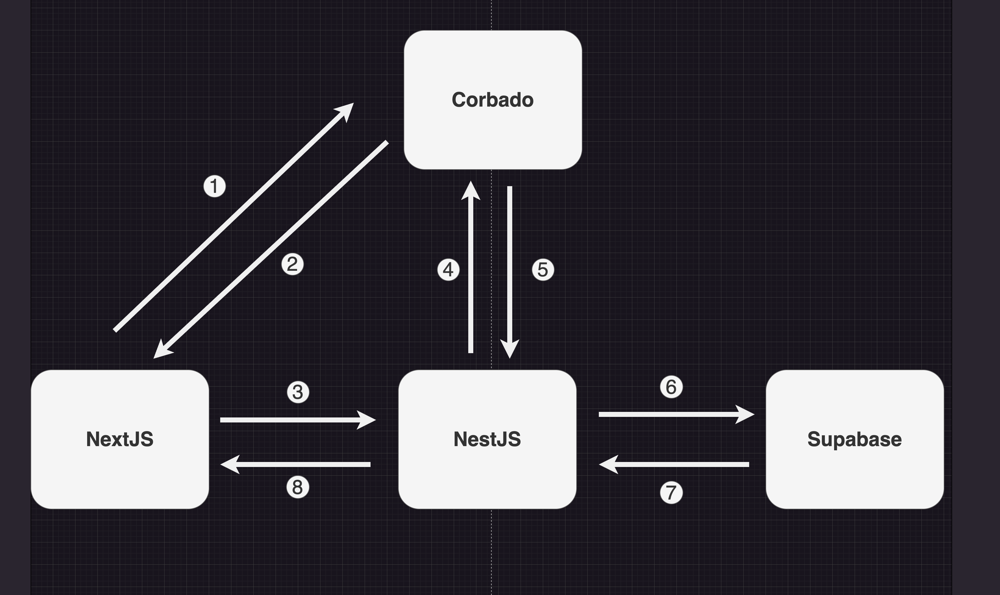

# Next-Nest-Corbado-Supabase-Prisma

## Demo

You can try it out at this [URL](https://next-nest-corbado-supabase-prisma.vercel.app/)

## Architecture

### Frontend

- Next.js

### Backend

- NestJS

### Database

- Supabase

### Authentication

- Corbado



## Usage

```
https://github.com/koichi-omae/stak-onbording.git

cd frontend

yarn install

cd ..

cd backend

yarn install
```

## Settings

### Frontend

```
cd frontend

cp .env.example .env.local
```

```
.env.local

NEXT_PUBLIC_PROJECT_ID= → requreid
API_SECRET=

NEXT_PUBLIC_SUPABASE_URL=　→ requreid
NEXT_PUBLIC_SUPABASE_ANON_KEY=

NEXT_PUBLIC_BACKEND_URL=　→ requreid
```

### Backend

```
cd backend

cp .env.example .env
```

```
.env

SUPABASE_URL= → requreid
SUPABASE_API_KEY= → requreid

CORBADO_PROJECT_ID= → requreid
CORBADO_API_KEY= → requreid
CORBADO_BACKEND_API=
```
